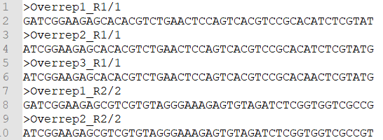

```{r, include=F}
library(kableExtra)
```
# Overview  
  
This document describes the metagenomic analysis pipeline by Edna Chiang and Andrew Steinberger from the Suen Lab.
  
This tutorial assumes you have a basic understanding of metagenomics and linux command line. It provides recommendations and guidance in choosing and using software to perform your own metagenomic analysis on paired-end data.  

While many of the steps and concepts are translatable to single-end data, many of the software programs are incompatible with single-end data.  

This guide doesn't discuss appropriate experimental design, DNA preparation, or sequencing methods.
  
To learn more about metagenomics, there are plentiful reviews to read. Here are a few to consider:  
  
* [Kunin, V., et al. (2008) Microbiol Mol Biol  Rev. A bioinformatician's guide to metagenomics](https://www.ncbi.nlm.nih.gov/pubmed/19052320)  
* [Sharpton, T.J. (2014) Front Plant Sci. An  introduction to the analysis of shotgun metagenomic data](https://www.ncbi.nlm.nih.gov/pubmed/24982662)  
* [Quince, C., et al. (2017) Nat Biotechnol. Shotgun metagenomics, from sampling to analysis](https://www.ncbi.nlm.nih.gov/pubmed/28898207)  
  
  
To learn more about command line, there are many online and on-campus resources. Here are a few to consider:  
  
* On-campus computing resources. For UW-Madison, this includes the [Biotechnology Center](https://www.biotech.wisc.edu/), which offers many computational workshops including [Linux Essentials](https://www.biotech.wisc.edu/services/brc/workshop/overview)
* [Software Carpentry](https://swcarpentry.github.io/shell-novice/)  
  
  
# 1) Define your question  
  
Before beginning any analysis, you must first define your question. How you analyze your data is completely dependent upon your question.  
Some ideas to consider:  
  
* Do you care only about the overall genomic composition and not about specific taxa?
* Do you want to identify specific taxa?  
* Do you want metagenome-assembled genomes?
* In what types of genes are you interested?
  
  
# 2) Evaluate data quality  
  
Use [FastQC](	https://www.bioinformatics.babraham.ac.uk/projects/fastqc/) to evaluate the quality of your raw fastq files.  
  
[FastQC](	https://www.bioinformatics.babraham.ac.uk/projects/fastqc/) will output a *.html* file with multiple plots.  
  
For additional resources in understanding FastQC outputs, refer to the following webpages:  
  
* [Example FastQC Outputs](https://www.bioinformatics.babraham.ac.uk/projects/fastqc/)
* [FastQC Manual](https://dnacore.missouri.edu/PDF/FastQC_Manual.pdf)
* [FastQC Tutorial](https://rtsf.natsci.msu.edu/sites/_rtsf/assets/File/FastQC_TutorialAndFAQ_080717.pdf)
  
```{r, eval=F}
/path/to/fastqc /path/to/fastq -o /path/to/output
```
* `/path/to/fastqc`
    + Opens the fastqc software
    + Replace with your path to fastqc
* `/path/to/fastq`
    + Specifies input fastq files
    + Replace with the path to your fastq input files
    + If you want to include more than 1 fastq file, just separate the files by 1 space
* `-o /path/to/output`
    + Specifies output folder
    + Replace */path/to/output* with the path to your output folder
  
If you find that fastqc isn't running and you get the following error:  
```{r, eval=F}
Exception in thread "main" java.awt.HeadlessException:
No X11 DISPLAY variable was set, but this program performed an operation which requires it.
```
  
Try adding ` &` (a space followed by an ampersand) at the very end of the command.  

  
The output plots to which I pay most attention are:  
  
* Basic Statistics  

* Per base sequence quality
    + Sequence quality naturally decreases near the tail-end of the sequence  

* Overrepresented sequences  
    + These sequences are often adapters/primers  

* Adapter Content  

  
  

  
  
# 3) Quality trim  
  
Use [Trimmomatic](http://www.usadellab.org/cms/?page=trimmomatic) to remove adapters/primers/overrepresented sequences and trim poor quality basepairs.  
  
```{r, eval=F}
java -jar /path/to/trimmomatic-0.36.jar PE -threads number -trimlog /path/to/trimmomatic/logfile /path/to/R1/fastq.gz /path/to/R2/fastq.gz -baseout /path/to/output.gz ILLUMINACLIP:/path/to/overrep_seqs.fa:2:30:10 LEADING:3 TRAILING:3 SLIDINGWINDOW:4:15 MINLEN:36
```
  
* `java -jar`
    + Because Trimmomatic is written in java, you must open the software using java
* `/path/to/trimmomatic-0.36.jar`
    + This tells the computer where to find the Trimmomatic software  
    + Depending on what version of Trimmomatic you download, you may have a different name for the *.jar* software  
    + Replace this with your path to the trimmomatic .jar file
* `PE`
    + Tells the program we are inputting paired-end data
    + Trimmomatic can also work with single-end data
* `-threads number`
    + Sets the number of threads/processors you want to use
    + Replace *number* with a numerical number of threads/processors you want to use
* `trimlog /path/to/trimmomatic/logfile.txt`
    + Specifies the location and name of your log file
    + Trimmomatic creates a log file of all read trimmings, including
      - read name
      - surviving sequence length
      - location of the first surviving base (amount trimmed from the start)
      - location of the last surviving base in the original read
      - amount trimmed from end
    + Replace */path/to/trimmomatic/logfile.txt* with the path to your logfile
* `/path/to/R1/fastq.gz`
    + Specifies location of your forward read fastq file
    + Trimmomatic accepts both *.fastq* and *.fastq.gz* files
    + Replace with the path to your fastq or fastq.gz file
* `/path/to/R2/fastq.gz`
    + Specify location of your reverse read fastq file
    + Trimmomatic accepts both *.fastq* and *.fastq.gz* files
    + Replace with the path to your fastq or fastq.gz file
* `-baseout /path/to/output.gz`
    + Specifies location of the output files:  
      - output_1P.gz
        * Paired forward reads
      - output_2P.gz
        * Paired reverse reads
      - output_1U.gz
        * Unpaired forward reads
      - output_2Ugz
        * Unpaired reverse reads
    + *output* will be the prefix of all output files
    + *.gz* outputs everything as a gzipped fastq file
    + There should be the same number of reads in `output_1P.gz` as in `output_2P.gz`
      * These are reads that have both a forward & reverse read (thus "paired")
    + Replace */path/to/output.gz* with the path to your output files
* `ILLUMINACLIP:/path/to/overrep_seqs.fa:2:30:10`
    + This removes specified sequences
      + Trimmomatic comes with adapter files for commonly used Illumina adapters
        + Refer to the [Trimmomatic website](http://www.usadellab.org/cms/?page=trimmomatic) for more info
      + You can also make your own custom adapter file

        + Sequences to be removed from forward reads must end with `/1`
        + Sequences to be removed from reverse reads must end with `/2`
    + `ILLUMINACLIP:`
        + Command to remove specific sequences
    + `/path/to/overrep_seqs.fa`
        + Replace this with the path Trimmomatic's provided adapter files or your own custom file
    + `:2:30:10`
        + Default parameters for adapter trimming. Refer to the [Trimmomatic website](http://www.usadellab.org/cms/?page=trimmomatic) for more info.
* `LEADING:3 TRAILING:3 SLIDINGWINDOW:4:15 MINLEN:36`
    + Trims poor quality bp's
    + The numbers are the default parameters. Refer to the [Trimmomatic website](http://www.usadellab.org/cms/?page=trimmomatic) for more info.

## Alternatives
I've also tested adapter removal with [cutadapt](https://cutadapt.readthedocs.io/en/stable/index.html) and quality trimming with [sickle](https://github.com/najoshi/sickle).  
I chose [Trimmomatic](http://www.usadellab.org/cms/?page=trimmomatic) over these two software simply because it is more efficient to use one program instead of two.  
  
  
# 4) Remove host contamination (optional)  
  
If you study host-associated microbiomes, host DNA contamination can greatly hinder metagenomic assembly by increasing required time and computational power and by decreasing assembly quality.  
  
If you have access to a genome of your host organism, I **strongly** recommend that you remove host contamination.  
   
I follow [this tutorial](http://www.metagenomics.wiki/tools/short-read/remove-host-sequences) for my host contamination removal.  
  
## 4A) Download host genome  
  
The following is an example of how I download the genome for my host organism (13-lined ground squirrel, *Ictidomys tridecemlineatus*).  
  
First, I download the host genome:
```{r, eval=F}
curl -O ftp://ftp.ncbi.nlm.nih.gov/genomes/all/GCA/000/236/235/GCA_000236235.1_SpeTri2.0/GCA_000236235.1_SpeTri2.0_assembly_structure/Primary_Assembly/unplaced_scaffolds/FASTA/unplaced.scaf.fna.gz
```
  
  
Next, I open the downloaded file:  
```{r, eval=F}
gunzip unplaced.scaf.fna.gz
```
  
  
Now I rename the genome to something that makes sense to me:  
```{r, eval=F}
mv unplaced.scaf.fna host.fna
```
  
  
## 4B) Build host genome database  
Use [bowtie2](http://bowtie-bio.sourceforge.net/bowtie2/index.shtml) to create a database from the host genome.  
```{r, eval=F}
/path/to/bowtie2-build --seed number /path/to/host.fna /path/to/database
```
* `/path/to/bowtie2/bowtie2-build`
    + Replace */path/to/bowtie2/* with your path to bowtie2.
    + Keep the text after the last slash ('bowtie2-build') because to calls on the build command within bowtie2
* `--seed number`
    + Sets the seed so that your work is reproducible
    + Replace *number* with a numerical number
* `/path/to/host.fna`
    + Specifies location of your host genome
    + Replace with the path to your host genome
* `/path/to/database`
    + Specifies location and name of your output database
    + Replace with the path to your output host database
  
  
## 4C) Map reads against host database  
We'll use [bowtie2](http://bowtie-bio.sourceforge.net/bowtie2/index.shtml) again.  
```{r, eval=F}
/path/to/bowtie2 --very-sensitive-local -p number --seed number -x /path/to/database -1 /path/to/R1/fastq.gz -2 /path/to/R2/fastq.gz -S /path/to/output.sam
```
**Note:** The output of this to terminal will include stats about % mapped. These stats are not saved in the output file, and you may want these for your records.  
  
* `bowtie2`
    + Calls on bowtie2
    + Replace with your path to bowtie2
* `--very-sensitive-local`
    + This does a local alignment that's very sensitive when matching so you get more matched reads
    + This setting is slower than other settings. If you want speed, use a less sensitive local setting
    + I use very sensitive because my main concern is removing all the host contamination I can to improve the quality of my assembly downstream. For me, speed is a minor concern
      + If you're mapping short reads to a big genome, **do not do a global alignment**!
* `-p number`
    + Sets the number of processors
    + Replace *number* with a numerical number
* `--seed number`
    + Sets the seed so that your work is reproducible
    + Replace *number* with a numerical number
* `-x /path/to/database`
    + Specifies your host database
    + Replace */path/to/database* with the path to your host database
* `-1 /path/to/R1/fastq.gz`
    + Specifies your forward read fastq file
    + Replace */path/to/R1/fastq.gz* with the path to your forward read fastq file
    + If you did the Trimmomatic step, this would be *output_1P.gz*
* `-2 /path/to/R2/fastq.gz`
    + Specifies your reverse read fastq file
    + Replace */path/to/R2/fastq.gz* with the path to your reverse read fastq file
    + If you did the Trimmomatic step, this would be *output_2P.gz*
* `-S /path/to/output.sam`
    + Specifies your output file, which is in SAM format (gibberish to the normal human eye)
    + Replace */path/to/output.sam* with the path to your output .sam file
  
## 4D) Convert SAM file to BAM file  
A SAM file is huuuuuge, so we convert it into a BAM file to save room.  
  
The remaining steps will use the program [samtools](http://samtools.sourceforge.net/).
  
```{r, eval=F}
/path/to/samtools view -@ numbers -bS /path/to/output.sam > /path/to/output.bam
```
* `/path/to/samtools/samtools view`
    + Replace */path/to/samtools/* with your path to samtools
    + Keep everything after the last slash (*samtools view*) because this calls on the view command within samtools
* `-@ number`
    + Replace *number* with the numerical number of threads/processors you want to run
* `-bS`
    + Outputs a BAM file
* `/path/to/output.sam > /path/to/output.bam`
    + Specifies input SAM file and the output BAM file
    + Replace */path/to/output.sam* with the path to the output.sam file you made in the previous step (4C)
    + Keep * > *
    + Replace */path/to/output.bam* with the path to your output.bam file
  
  
## 4E) Extract unmapped reads (non-host)  
```{r, eval=F}
/path/to/samtools view -@ number -b -f 12 -F 256 /path/to/output.bam > /path/to/unmap.bam
```
* `/path/to/samtools view`
    + Replace */path/to/samtools/* with your path to samtools
    + Keep * view* (space followed by view) because this calls on the view command within samtools
* `-@ number`
    + Replace *number* with the number of threads/processors you want to run
* `-b`
    + Outputs a BAM file
* `-f 12`
    + Extracts only alignments with both reads unmapped
* `-F 256`
    + Does not extract aligns that are not primary alignment
* `/path/to/output.bam > /path/to/unmap.bam`
    + Specifies input BAM file and the output BAM file
    + Replace */path/to/output.bam* with the path to the output.bam file you made in the previous step (4D)
    + Keep * > *
    + Replace */path/to/unmap.bam* with the path to your output BAM file
  
  
## 4F) Sort BAM file to organize paired reads  
```{r, eval=F}
/path/to/samtools sort -n /path/to/unmap.bam -o /path/to/unmap.sorted.bam
```
  
* `/path/to/samtools sort`
    + Replace */path/to/samtools/* with your path to samtools
    + Keep * sort* (space followed by sort) because this calls on the view command within samtools
* `-n`
    + Sorts by read name
* `/path/to/unmap.bam`
    + Replace with the path to the unmap.bam file you made in the previous step (4D)
* `-o /path/to/unmap.sorted.bam`
    + *-o* specifies output
    + Replace *path/to/unmap.sorted.bam* with the path to your output BAM file

  
## 4G) Convert BAM to fastq  
```{r, eval=F}
/path/to/samtools bam2fq /path/to/unmap.sorted.bam > /path/to/nohost.fastq
```
* `/path/to/samtools bam2fq`
    + Replace */path/to/samtools* with your path to samtools
    + Keep *bam2fq* because this calls on the bam2fq command within samtools
* `/path/to/unmap.sorted.bam`
    + Replace with the path to the unmap.sorted.bam file you made in the previous step (4E)
* `/path/to/nohost.fastq`
    + Replace with path to your output .fastq file
    + The output is an interleaved fastq file
  
  
## Alternatives  
* You can use [bowtie2](http://bowtie-bio.sourceforge.net/bowtie2/index.shtml) flag `--un-conc` to directly pull out unmapped reads if you don't need the flexibility of the long samtools pipeline
* The [Hurwitz Lab](https://github.com/hurwitzlab/Host-Screen) has a nice script to remove host contamination.
  
  
# 5) Evaluate data quality  
  
This is the same as Step 2.  
  
Use [FastQC](	https://www.bioinformatics.babraham.ac.uk/projects/fastqc/) to evaluate the quality of your raw fastq files.  
  
[FastQC](	https://www.bioinformatics.babraham.ac.uk/projects/fastqc/) will output a *.html* file with multiple plots.  
  
For additional resources in understanding FastQC outputs, refer to the following webpages:  
  
* [Example FastQC Outputs](https://www.bioinformatics.babraham.ac.uk/projects/fastqc/)
* [FastQC Manual](https://dnacore.missouri.edu/PDF/FastQC_Manual.pdf)
* [FastQC Tutorial](https://rtsf.natsci.msu.edu/sites/_rtsf/assets/File/FastQC_TutorialAndFAQ_080717.pdf)
  
  
```{r, eval=F}
/path/to/fastqc /path/to/fastq -o /path/to/output
```
* `/path/to/fastqc`
    + Replace with your path to fastqc
* `/path/to/fastq`
    + Replace with your input fastq file(s)
    + To include more than 1 fastq file, just separate each file path by 1 space
* `-o /path/to/output`
    + *-o* specifies output
    + Replace */path/to/output* with the path to your output file(s)
  
If you find that fastqc isn't running and you get the following error:  
```{r, eval=F}
Exception in thread "main" java.awt.HeadlessException:
No X11 DISPLAY variable was set, but this program performed an operation which requires it.
```
  
Try adding ` &` (space followed by an ampersand) at the very end of the command.  
  
  
# 6) Taxonomic profile (optional)  
  
This step gives you a quick look at what taxa comprise your metagenome. You can think of this as a preliminary option before binning.  

My profiler of choice is [Kaiju](http://kaiju.binf.ku.dk/) because it gave me the highest percentage of classified reads. However, it does require quite a bit of RAM. If you are limited by computational power, I suggest using [Centrifuge](https://ccb.jhu.edu/software/centrifuge/). You can read more about other alternatives by scrolling down to the bottom of this step.


```{r, eval=F}
/path/to/kaiju -t /path/to/kaiju/database/nodes.dmp -f /path/to/kaiju/database/file.fmi -i /path/to/input/file.fastq -o /path/to/output/file/kaiju.output -z number -E 1e-05 -v
```
* `/path/to/kaiju`
    + Replace with your path to kaiju
* `-t /path/to/kaiju/database/nodes.dmp`
    + *-t* specifies
    + Replace */path/to/kaiju/database/nodes.dmp* with your path to the NCBI taxonomy nodes.dmp file
* `-f /path/to/kaiju/database/file.fmi`
    + *-f* specifies
    + Replace */path/to/kaiju/database/file.fmi* with your path to the NCBI taxonomy .fmi file
* `-i /path/to/input/file.fastq`
    + *-i* specifies input. This can be .fastq, .fasta, or .ffn
    + Replace */path/to/input/file.fastq* with the path to your input file
* `-o /path/to/output/file/kaiju.output`
    + *-o* saves the kaiju output. If you exclude this flag, kaiju will print the output to the terminal rather than save to a file.
    + Replace */path/to/output/file/kaiju.output* with the path to your output file
* `-z number`
    + Number of threads
* `-E 1e-05`
    + This specifies the E-value cutoff. This cutoff should always be less than or equal to 1e-05.
* `-v`
    + Verbose option that prints additional columns to kaiju output

After you run Kaiju, you'll want to convert the kaiju output file(s) into a summary table using kaiju's `kaiju2table` function:

```{r, eval=F}
/path/to/kaiju2table -t /path/to/kaiju/database/nodes.dmp -n /path/to/kaiju/database/names.dmp -r taxonomic_level -o /path/to/output/table.tsv /path/to/output/file/kaiju.output -l taxonomic,levels,separated,by,commas
```
* `/path/to/kaiju2table`
    + Calls upon kaiju2table function
* `-t /path/to/kaiju/database/nodes.dmp`
    + Path to NCBI taxonomy nodes.dmp file
* `-n /path/to/kaiju/database/names.dmp`
    + Path to NCBI taxonomy names.dmp file
* `-r taxonomic_level`
    + Specifies what taxonomic level you want in the output table
* `-o /path/to/output/table.tsv`
    + Path to the output classification table
* `/path/to/output/file/kaiju.output`
    + Path to the output file you created in the previous code chunk.
* `-l taxonomic,levels,separated,by,commas`
    + Specifies the taxonomic levels to be printed
    + For example: `-l superkingdom,phylum,class,order,family,genus,species`
  

  
## Alternatives 
* [Kraken 2](https://ccb.jhu.edu/software/kraken2/) and [Bracken](https://ccb.jhu.edu/software/bracken/)
    + Kraken 2 requires *a lot* of disk space and RAM to run. You need 100 GB of disk space to store the kraken 2 database and > 29 GB of RAM to run the program.
* [Centrifuge](https://ccb.jhu.edu/software/centrifuge/)
    + The smaller, more efficient version of kraken
* [mOTU](http://www.bork.embl.de/software/mOTU/tutorial.motu.standalone.html) and [fetchMG](http://www.bork.embl.de/software/mOTU/fetchMG.html)
    + Uses single copy marker genes
    + The output contains species-level classifications, but you have to figure out the higher level classifications (Phylum --> Family)
* [MetaPhlAn2](https://bitbucket.org/biobakery/metaphlan2)
    + Only classifies bacteria
    + This program gave me some odd taxonomic classifications

  
# 7) Assemble  
  
There are new assemblers being developed all the time, with each assembler suited for different needs and data types. 
  
I've tested 3 assemblers:  
  
* [IDBA_UD](http://i.cs.hku.hk/~alse/hkubrg/projects/idba_ud/)
* [metaSPAdes](http://cab.spbu.ru/software/spades/)
* [MEGAHIT](https://github.com/voutcn/megahit)
  
Here are the pros/cons of each assembler:  

* metaSPAdes
    + Pros:
        + Good documentation
        + Larger # of bp's are incorporated into final assembly compared to IDBA_UD
        + Creates largest contigs
    + Cons:
        + Overall N50 is lower than than of IDBA_UD. However, if you remove shorter contigs (e.g. < 500 bp), the N50 will be larger than that of IDBA_UD
* IDBA_UD
    + Pros:
        - Highest N50 compared to metaSPAdes and MEGAHIT when you keep all contigs and don't use a bp cutoff
    + Cons:
        - Poor documentation
        - Inflexible input options

* MEGAHIT
    + Pros:
        + Fastest (< 30 min)
        + Least computationally expensive
    + Cons:
        + Gave the poorest quality assemblies
  
  
Recommendations:  
  
* **metaSPAdes** = For those with beginner experience who do not lack time and/or computational resources.
* **IDBA_UD** = For those with at least intermediate experience who do not lack time and/or computational resources.  
* **MEGAHIT** = For those with little experience, little time, and/or limited computational resources.  
  
  
Ultimately, the relatively "best" assembler will differ based on your data set. If you have the time and resources, try out a few. If you do not have the time and resources, pick one and run with it. 
  
  
## 7A) IDBA_UD  
  
[IDBA_UD website](http://i.cs.hku.hk/~alse/hkubrg/projects/idba_ud/)  
  
  
### 7A.1) Convert fastq to fasta  
IDBA_UD accepts only 1 fasta file per metagenome.  
  
#### Interleaved  
This is when you have 1 fastq file per metagenome.
```{r, eval=F}
idba-1.1.3/bin/fq2fa --paired --filter /path/to/fastq /path/to/output.fa
```
* `idba-1.1.3/bin/fq2fa`
    + Calls upon the command to convert fastq to fasta
    + This part of the command will change depending on what version of IDBA_UD you're using
* `/path/to/fastq`
    + Specifies location of input fastq file
* `/path/to/output.fa`
    + Specifies name and location of output fasta file
  
  
#### File pairs  
This is when you have 2 fastq files per metagenome.
```{r, eval=F}
idba-1.1.3/bin/fq2fa --merge --filter path/to/R1/fastq /path/to/R2/fastq /path/to/output/fasta
```
* `idba-1.1.3/bin/fq2fa`
    + Calls upon the command to convert fastq to fasta
    + This part of the command will change depending on what version of IDBA_UD you're using
* `/path/to/R1/fastq`
    + Specifies location of forward read input fastq file
* `/path/to/R2/fastq`
    + Specifies location of reverse read input fastq file
* `/path/to/output.fa`
    + Specifies name and location of output fasta file
  
  
### 7A.2) Assemble  
```{r, eval=F}
idba-1.1.3/bin/idba_ud -r /path/to/output.fa --mink 45 --maxk 125 --step 20 --num_threads number -o /path/to/output/directory
```
* `idba-1.1.3/bin/idba_ud`
    + Calls upon assembler
* `-r /path/to/output.fa`
    + `-r` specifies that this is the input fasta file
    + `/path/to/output.fa/` specifies the location of the fasta file you made in the previous step
* `--mink 45 --maxk 125 --step 20`
    + This sets the kmer combo to:
        + 45, 65, 85, 105, 125
    + I chose this kmer combo due to the compromise between speed and % of input reads that map to the final assembly. You can get huge N50's with IDBA_UD, but these usually represent 50 - 60% of your input reads and are hugely biased towards abundant community members. This kmer combo doesn't create the largest N50, but the assembly has a higher % of input reads map that map to it.  
    + `--mink 45`
        + Minimum kmer size = 45
    + `--maxk 125`
        + Maximum kmer size = 125
    + `--step 20`
        + Go from min kmer to max kmer by steps of 20
* `--num_threads number`
    + Sets number of threads/processors
* `-o /path/to/output/directory`
    + Specifies output folder
  
  
## 7B) MetaSPAdes  
  
[metaSPAdes website](http://cab.spbu.ru/software/spades/)  
  
### Interleaved  
This is when you have 1 fastq file per metagenome.  
```{r, eval=F}
spades-3.12.0 --meta --pe1-12 /path/to/fastq -k 55,75,95 -t number_threads -m number_memory -o /path/to/output
```
* `spades-3.12.0`
    + Calls upon the assembler
    + This will change depending on what version you're using
* `--meta`
    + Tells the program that you're doing a metagenome assembly
    + This is the same thing as running the command `metaspades.py`
* `--pe1-12 /path/to/fastq`
    + `--pe1`
        + Tells program you're using paired end reads
        + The first `1` tells the program this is your first sample. This is only ever changed if you run normal SPAdes (**not** metaSPAdes).
    + `-12`
        + Refers to interleaved reads (1 input file)
    + `/path/to/fastq`
        + Specifies location of your input fastq file
* `-k 55,75,95`
    + Specifies kmers
    + I chose the combination *55, 75, 95* because I felt this gave the best compromise between speed and quality. You may prefer a different combination.
* `-t number_threads`
    + Specifies number of threads/processors
* `-m number_memory`
    + Specifies the amount of memory that metaSPAdes will use
    + If this is too low, you'll run out of memory and receive an error.
* `-o /path/to/output`
    + Specifies location & name of output directory
  
  
### File pairs  
  
This is when you have 2 fastq files per metagenome.  
```{r, eval=F}
spades-3.12.0 --meta --pe1-1 /path/to/R1/fastq --pe1-2 /path/to/R2/fastq -k 55,75,95 -t number_threads -m number_memory -o /path/to/output
```
* `spades-3.12.0`
    + Calls upon the assembler
    + This will change depending on what version you're using
* `--meta`
    + Tells the program that you're doing a metagenome assembly
    + This is the same thing as running the command `metaspades.py`
* `--pe1-1 /path/to/R1/fastq`
    + `--pe1`
          + Tells program you're using paired end reads
          + The first `1` tells the program this is your first sample. This is only ever changed if you run normal SPAdes (**not** metaSPAdes).
    + `-1`
          + Refers to your forward read
    + `/path/to/R1/fastq`
          + Specifies location of your input forward read fastq file
* `--pe1-2 /path/to/R1/fastq`
    + `--pe1`
        + Tells program you're using paired end reads
        + The first `1` tells the program this is your first sample. This is only ever changed if you run normal SPAdes (**not** metaSPAdes).
    + `-2`
        + Refers to your reverse read
    + `/path/to/R2/fastq`
        + Specifies location of your input reverse read fastq file
* `-k 55,75,95`
    + Specifies kmers
    + I chose the combination *55, 75, 95* because I felt this gave the best compromise between speed and quality. You may prefer a different combination.
* `-t number_threads`
    + Specifies number of threads/processors
* `-m number_memory`
    + Specifies memory to be allocated to assembly
    + If this is too low, you'll run out of memory and receive an error
* `-o /path/to/output`
    + Specifies location & name of output directory
  
  
## 7C) MegaHit  
  
[MEGAHIT website](https://github.com/voutcn/megahit)  
  
  
### Interleaved  
This is when you have 1 fastq file per metagenome.  
```{r, eval=F}
megahit --12 /path/to/fastq --k-list numbers -o /path/to/output
```
* `megahit`
    + Calls upon assembler
* `--12 /path/to/fastq`
    + `--12`
        + Indicates interleaved input fastq
    + `/path/to/fastq`
        + Specifies location of input fastq file
* `--k-list numbers`
    + Specifies kmers to user
      + Be sure to use **more than 1 kmer**! This will greatly improve the quality of your assembly
* `-o /path/to/output`
    + `-o`
        + Indicates output
    + `/path/to/output`
        + Specifies location of output
  
  
### File Pairs  
This is when you have 2 fastq files per metagenome.  
```{r, eval=F}
megahit --1 /path/to/R1/fastq --2 /path/to/R2/fastq --k-list number -o /path/to/output
```
* `megahit`
    + Calls upon assembler
* `--1 /path/to/R1/fastq`
    + `--1`
        + Specifies forward read
    + `/path/to/R1/fastq`
        + Specifies location of input forward read fastq file
* `--2 /path/to/R2/fastq`
    + `--2`
        + Specifies reverse read
    + `/path/to/R2/fastq`
        + Specifies location of input reverse read fastq file
* `--k-list number`
    + Specifies kmers to user
    + Be sure to use **more than 1 kmer**!!! This will greatly improve the quality of your assembly
* `-o /path/to/output`
    + `-o`
        + Indicates output
    + `/path/to/output`
        + Specifies location of output
  
  
# 8) Evaluate assembly (part 1)  
Use [metaquast](http://quast.sourceforge.net/metaquast) to evalute assembly quality.  
  
The output includes an *.html* file that includes various statistics about your assembly.  
  
The stats to which I like to pay particular attention include:  
  
* Number of Contigs
    + Smaller = more likely to have larger contigs
* N50
    + The minimum contig length needed to cover 50% of the genome
    + Similar to median contig length, but weighted towards longer contigs
    + Larger is generally better
* Total length
    + Longer = more bp's incorporated into your assembly
  
```{r, eval=F}
/metaquast.py -m min_contig_length -t number /path/to/assembly1/fasta /path/to/assembly2/fasta /path/to/assembly3/fasta -o /path/to/output
```
  
* `/metaquast.py`
    + Calls upon command
* `-m min_contig_length`
    + Sets minimum contig cutoff length.
* `-t number`
    + Sets number of threads/processors
* `/path/to/assembly1/fasta /path/to/assembly2/fasta /path/to/assembly3/fasta`
    + Path to your assembly output
    + You can include more than 1 assembly to evaluate. The output will include all of them in 1 document
* `-o /path/to/output`
    + Specifies your output directory
  
  
# 9) Evaluate assembly (part 2)  
In addition to the stats output by metaquast, another way to evaluate assembly quality is the % of input reads that were incorporated into the final assembly.  
  
You don't expect 100% of the input reads to be incorporated because there will inevitably be reads that are poor quality, artifacts, or too short (even after your quality trimming). However, you do want to incorporate as many of the good reads as possible.  
  
We also have to format our assembly into a form that will be usable by binning programs (if you plan on binning; see step #10).  
  
Use [bowtie2](http://bowtie-bio.sourceforge.net/bowtie2/index.shtml) to stats of input reads incorporated into the final assembly.  
  
The steps are very similar to step #4 (host contamination removal)
  
## 9A) Separate interleaved input (optional)  
This step is only run if your intput files were interleaved.  
Use the function [deinterleave_fastq.sh](		https://gist.github.com/nathanhaigh/3521724).  
  
```{r, eval=F}
deinterleave_fastq.sh < /path/to/input/fastq /path/to/input/R1/fastq /path/to/input/R2/fastq
```
  
* `deinterleave_fastq.sh <`
    + Calls upon command
* `/path/to/input/fastq`
    + This is the interleaved fastq file you intput into your assembly
* `/path/to/input/R1/fastq`
    + This is the location & name of your output forward read fastq file
* `/path/to/input/R@/fastq`
    + This is the location & name of your output reverse read fastq file
  
  
## 9B) Build assembly database  
We convert your assembly into a database.  
```{r, eval=F}
bowtie2-build –seed number /path/to/assembly/fasta /path/to/output/database
```
* `bowtie2-build`
    + Calls upon command
* `-seed number`
    + Sets the seed so that your work is **reproducible**.  
* `/path/to/assembly/fasta`
    + Specifies location of your assembly fasta output file
* `/path/to/output/database`
    + Specifies location and name for your output database
  
  
## 9C) Map input reads to assembly  
```{r, eval=F}
bowtie2 --sensitive-local -p number_processors --seed number  -x /path/to/database -1 /path/to/R1/fastq -2 /path/to/R2/fastq -S /path/to/output.sam
```
**Note:** The output of this to terminal will include stats about % mapped. These stats are not saved in the output file, and you will want these for your records.  
  
* `bowtie2`
    + Calls upon bowtie2
* `--sensitive-local`
    + This does a local alignment that is sensitive when matching so you get more matched reads
    + If you're mapping short reads to a big genome, **do not do a global alignment**!!!
    + This setting is slower than other settings. If you want speed, use a less sensitive local setting
* `-p number_processors`
    + Sets the number of threads
    + Replace *number_processors*
* `--seed number`
    + Sets the seed so that your work is **reproducible**
* `-x /path/to/database`
    + Specifies your assembly database
    + This is the output from the previous step #9B
* `-1 /path/to/R1/fastq.gz`
    + Specifies your input forward read fastq file
* `-2 /path/to/R2/fastq.gz`
    + Specifies your intput reverse read fastq file
* `-S /path/to/output.sam`
    + Specifies your output file, which is in SAM format (gibberish to the normal human eye)
  
  
## 9D) Index your assembly  
  
This step is for organizing your files to prepare for downstream processing.  
```{r, eval=F}
samtools faidx /path/to/assembly/fasta
```
  
* `samtools faidx`
    + Calls upon command
* `/path/to/assembly/fasta`
    + Specifies location of your assembly output fasta file
  
The output is a *.fai* file in the same direcotyr of your intput file
  
  
## 9E) Create BAM file  
A SAM file is huuuuuge, so we convert it into a BAM file to save room.  
  
The remaining steps will use the program [samtools](http://samtools.sourceforge.net/).
```{r, eval=F}
samtools import /path/to/assembly/fasta.fai /path/to/output.sam /path/to/output.bam
```
  
* `samtools import`
    + Calls upon command
* `/path/to/assembly.fasta.fai`
    + Specifies location of the *.fai* file you created in the previous step (#9D)
    + This should be located in the same directory of your input file in step #9D, unless you explcitly specified a different output location
* `/path/to/output.sam`
    + Specifies location of the *.sam* file you created in step #9C
* `/path/to/output.bam`
    + Specifies location of your output *.bam* file
  
  
## 9F) Sort BAM file  
This step is for organizing your files to prepare for downstream processing.  
```{r, eval=F}
samtools sort -m number_memory -@ number_threads /path/to/output/bam -o /path/to/sorted.output.bam
```
* `samtools sort`
    + Calls upon command
* `-m number_memory`
    + Sets amount of memory per thread/processor
* `-@ number_threads`
    + Sets number of threads/processors
* `/path/to/output.bam`
    + Specifies location of *.bam* file you created in the previous step (#9E)
* `/path/to/sorted/output/bam`
    + Specifies location and name of your output file, which is still a *.bam* but now it's sorted & organized appropriately for downstream analyses
  
  
## 9G) Index BAM file  
This step is for organizing your files to prepare for downstream processing. 
```{r, eval=F}
samtools index -@ number /path/to/sorted/output/bam
```
* `samtools index`
    + Calls upon command
* `-@ number`
    + Sets number of threads/processors
* `/path/to/sorted/output/bam`
    + Specifies location of the *.bam* file you made in the previous step (#9F)
  
  
## 9H) Generate assembly stats  
Time to calculate some stats about your assembly.  
```{r, eval=F}
samtools idxstats /path/to/sorted/output/bam > /path/to/idxstats.txt
```
* `samtools idxstats`
    + Calls upon command
* `/path/to/sorted/output/bam`
    + Specifies location of the *.bam* file you made in the previous step (#9G)
* `> /path/to/idxstats.txt`
    + Specifies location of your output stats, saved as a *.txt* file
  
  
## 9I) Generate count table  
Use [get_count_table.py](https://github.com/edamame-course/Metagenome/blob/master/get_count_table.py) to generate more stats about your assembly.  
```{r, eval=F}
python get_count_table.py /path/to/idxstats.txt > /path/to/counts.txt
```
* `python get_count_table.py`
    + Calls upon command
* `/path/to/idxstats.txt`
    + Specifies location of the stats *.txt* file you created in the previous step (#9H)
* `> /path/to/counts.txt`
    + Specifies location of your output count file, saved as a *.txt* file
    + This is analogous to an amplicon sequencing OTU table
  
  
# 10) Binning (optional)  
This step takes your assembly, and separates contigs into different "bins," each representing a taxonomic group (ex. different species).  
  
There are many software programs to accomplish this, including:
  
* [MetaBAT](https://bitbucket.org/berkeleylab/metabat)
* [Anvi'o](http://merenlab.org/software/anvio/)
* [CONCOCT](https://concoct.readthedocs.io/en/latest/)
  
  
Here, I'll only be talking about [MetaBAT](https://bitbucket.org/berkeleylab/metabat) because that is the only program that I've used so far.  
However, I plan to explore [Anvi'o](http://merenlab.org/software/anvio/) in the future and I encourage you to visit their website. It's a well-documented software with an active and responsive community if you need help.  
  
  
Please refer to the [MetaBAT Binning Tutorial](https://bitbucket.org/berkeleylab/metabat/wiki/Best%20Binning%20Practices) for more information about this step.  
  
  
## 10A) Summarize BAM depth
Use [MetaBAT](https://bitbucket.org/berkeleylab/metabat) to generates more stats about your assembly contig depth, which we'll use later in binning.  
```{r, eval=F}
/metabat/jgi_summarize_bam_contig_depths --outputDepth /path/to/output/depth.txt /path/to/sorted/output/bam
```
* `/metabat/jgi_summarize_bam_contig_depths`
    + Calls upon command
* `--outputDepth /path/to/output/depth.txt`
    + Calculates contig depths
    + Specifies location of output *.txt* file
* `/path/to/sorted/output/bam`
    + Specifies location of *.bam* file you made in step #9G
    
  
## 10B) Bin Contigs  
Please refer to [MetaBAT](https://bitbucket.org/berkeleylab/metabat) for parameters to set for your binning. There are lots of options, and it's up to you to select what is best for your purposes. I do not include those parameters in the code displayed below.  
```{r, eval=F}
metabat2 -i /path/to/assembly/fasta -a /path/to/output/depth.txt -o /path/to/output/directory -v --seed #
```
* `metabat2`
    + Calls upon command
* `-i /path/to/assembly/fasta`
    + Specifies location of your assembly output fasta file
* `-a /path/to/output/depth.txt`
    + Specifies path to the *.txt* file you made in the previous step (#10A)
* `-o /path/to/output/directory`
    + Specifies location and name of the output directory
* `-v`
    + Sets output to "verbose", so it'll print out lots of messages as it's running and you can follow along with each step
* `--seed #`
    + Sets the seed so that your work is **reproducible**  
  
  
## 10C) Evaluate Bins  
Use [CheckM](https://github.com/Ecogenomics/CheckM/wiki) to evaluate the quality of your bins.  
```{r, eval=F}
checkm lineage_wf -t number -x fa -f /path/to/output.txt /path/to/bin/directory /path/to/output/directory
```
* `checkm lineage_wf`
    + Calls upon command
* `-t number`
    + Sets number of threads/processors
* `-x fa`
    + Specifies that your input files are in *.fasta* form
* `-f /path/to/output.txt`
    + Specifies name and location of the output *.txt* file
* `/path/to/bin/directory`
    + Specifies location of your bins
    + This is the same as step #10B's `/path/to/output/directory`
* `/path/to/output/directory`
    + Specifies location of CheckM output
  
  
# 11) Predict ORFs  
  
Use [prodigal](https://github.com/hyattpd/Prodigal) to predict open reading frames.  
The guide here on prodigal is not comprehensive, so please consult the [prodigal website](https://github.com/hyattpd/Prodigal) for information on additional parameters.  
  
You can predict open reading frames in your assembly (output from step #7) or in your bins (output from step #10) depending on your goals.  
  
```{r, eval=F}
path/to/prodigal -a path/to/output.faa -d path/to/output.ffn -i /path/to/assembly/fasta -o /path/to/output.gbk -p meta -s /path/to/output/genes.gff
```
* `path/to/prodigal`
    + Calls upon prodigal
* `-a path/to/output.faa`
    + Specifies output .faa file
* `-d path/to/output.ffn`
    + Specifies output .ffn file
* `-i /path/to/assembly/fasta`
    + Path to assembly fasta file
* `-o /path/to/output.gbk`
    + Specifies the gene coordinates output file. The default file format is .gbk (Genbank-like format), but there are also other formats.
* `-p meta`
    + Specifies prediction mode for metagenomes: anonymous mode.
* `-s /path/to/output/genes.gff`
    + Specifies GFF3 output file. Contains all potential genes with scores.
    


# Predict genes  
  
The genes you want to target will completely depend on your question. Databases that I've used are:  

* [Clusters of Orthologous Groups (COG)](https://www.ncbi.nlm.nih.gov/COG/)
* [DataBase for Automated Carbohydrate-Active Enzyme Annotation (dbCAN)](http://csbl.bmb.uga.edu/dbCAN/)
* [Simultaneous Classification and Motif Identification for enzyme/CAZyme annotation (eCAMI)](https://github.com/yinlabniu/eCAMI)
* [Protein Families (Pfam)](https://pfam.xfam.org/)  


  
## COG
[Clusters of Orthologous Groups (COG) website](https://www.ncbi.nlm.nih.gov/COG/)
  
You will use [rpsblast](http://nebc.nox.ac.uk/bioinformatics/docs/rpsblast.html) to predict COGs. I encourage you to explore the [rpsblast website](http://nebc.nox.ac.uk/bioinformatics/docs/rpsblast.html) to determine what parameters you will need as this will change depending on your goals and plans for downstream analyses. Below are the parameters and steps I use.

```{r, eval=F}
path/to/rpsblast -db /path/to/COG_database -query /path/to/prodigal.faa -out /path/to/output.txt -evalue 1e-05 -outfmt '6 qseqid sseqid pident length mismatch gapopen qstart qend sstart send evalue bitscore qcovs' -num_threads number
```
* `path/to/rpsblast`
    + Calls upon [rpsblast](http://nebc.nox.ac.uk/bioinformatics/docs/rpsblast.html)
* `-db /path/to/COG_database`
    + Specifies COG database
* `-query /path/to/prodigal.faa`
    + Specifies input file: .faa file from prodigal
* `-out /path/to/output.txt`
    + Specifies output file
* `-evalue 1e-05`
    + E-value cutoff should less than or equal to 1e-05
* `-outfmt '6 qseqid sseqid pident length mismatch gapopen qstart qend sstart send evalue bitscore qcovs'`
    + Specifies format/columns for output file
    + I use format 6 so I can assign COG categories to query protein sequences using [cdd2cog.pl](https://github.com/aleimba/bac-genomics-scripts/tree/master/cdd2cog) (next step)
* `-num_threads number`
    + Sets number of threads/[processors]
  
After running rpsblast, you'll want to assign COG categories to your query protein sequences. I use [cdd2cog.pl written by Andreas Leimbach](https://github.com/aleimba/bac-genomics-scripts/tree/master/cdd2cog). 
  
To prepare for stats, I create a COG table where rows = COG ID and columns = sample. You can make this using my python script [formatCOG.py](https://github.com/ednachiang/MetaG_Pipeline/tree/master/COG_scripts/formatCOG.py).  
  
To normalize your COG counts, you can normalize to universal single copy COGs. I'm working on a script to do this and will update this tutorial whenever I finish it.  
Here are papers that have used this normalization method:  

* [Ciccarelli, et al. (2006) Science. Toward Automatic Reconstruction of a Highly Resolved Tree of Life](https://science.sciencemag.org/content/311/5765/1283)
* [Raes, et al. (2007) Genome Biol. Prediction of effective genome size in metagenomic samples](https://genomebiology.biomedcentral.com/articles/10.1186/gb-2007-8-1-r10)
* [Mende, et al. (2013) Nat Methods. Accurate and universal delineation of prokaryotic species](https://www.nature.com/articles/nmeth.2575)
* [Eiler, et al. (2014) Environ Microbiol. Productivity and salinity structuring of the microplankton revealed by comparative freshwater metagenomics](https://pubmed.ncbi.nlm.nih.gov/24118837/)
* [Fortunato, et al. (2015) PLOS ONE. Microbial Gene Abundance and Expression Patterns across a River to Ocean Salinity Gradient](https://journals.plos.org/plosone/article?id=10.1371/journal.pone.0140578)
  

## dbCAN  
[DataBase for Automated Carbohydrate-Active Enzyme Annotation (dbCAN) website](http://csbl.bmb.uga.edu/dbCAN/)  
  
You can use the [online dbCAN server](http://bcb.unl.edu/dbCAN2/) or download [dbCAN2](https://github.com/linnabrown/run_dbcan).
  
I used an older iteration of dbCAN and describe my steps below.
  
You will use [hmmer](http://hmmer.org/) to predict [carbohydrate-active enzymes (CAZymes)](http://www.cazy.org/). I encourage you to explore the [hmmer website](ttp://hmmer.org/) to determine what parameters you will need as this will change depending on your goals and plans for downstream analyses. Below are the parameters and steps I use.  
 
```{r, eval=F}
/path/to/hmmer/hmmscan --cpu number --tblout /path/to/output.tbl --domtblout /path/to/output/domain.tbl -o /path/to/output.txt -E 1e-05 /path/to/dbCAN-HMMdb-V8.txt /path/to/input/prodigal.faa

```
* `/path/to/hmmer/hmmscan`
    + Call upon hmmscan function
* `--cpu number`
    + Specifies number of processors
* `--tblout /path/to/output.tbl` 
    + Specifies output table that summarizes the per-target output.
* `--domtblout /path/to/output/domain.tbl`
    + Specifies domain table that summarizes summarizing the per-domain output. Each line
* `-o /path/to/output.txt`
    + Specifies output file. It starts with a header summarizing what you ran. The next section is a list of sequence top hits.
* `-E 1e-05` 
    + E-value should be less than or equal to 1e-05
* `/path/to/dbCAN-HMMdb-V8.txt`
    + Specifies dbCAN hmmer database. The file name will differ if you're using a different version of dbCAN
* `/path/to/input/prodigal.faa` 
    + Specifies input .faa file (output from prodigal)

To make sense of the dbCAN output, I parse it to create a table that lists each ORF with a predicted CAZyme and its top CAZyme hit, as well as a count of each CAZyme class. Andrew Steinberger wrote two scripts for this, [one in perl](https://github.com/ednachiang/MetaG_Pipeline/tree/master/dbCAN_scripts/dbcanParse.pl) and [one in python](https://github.com/ednachiang/MetaG_Pipeline/tree/master/dbCAN_scripts/dbcanParse.py)

To prepare the data for stats, I create two tables:  

1. A count table where rows = CAZyme families and columns = samples
2. A classification table where rows = CAZyme families and columns = class-level and family-level CAZyme classifications. These are formatted so they can be analyzed in R with the [phyloseq package](https://joey711.github.io/phyloseq/).  
  
For reference, this is the [script](https://github.com/ednachiang/MetaG_Pipeline/tree/master/dbCAN_scripts/dbcan.summarize.py) I use to create the two tables. This script isn't intended to be downloaded and used because it's written specifically for my sample nomenclature, but I've linked it here as reference if you write your own script.  


## eCAMI
[Simultaneous Classification and Motif Identification for enzyme/CAZyme annotation (eCAMI) website](https://github.com/yinlabniu/eCAMI)  
This program classifies to carbohydrate-active enzymes (CAZymes) and enzyme commission number.  
I use eCAMI primarily for enzyme commission number classification. For CAZyme classification, I prefer to use dbCAN because it's older and more well known. eCAMI and dbCAN are both written by the [Yin Lab](http://bcb.unl.edu/).  
  


## Pfam  
[Protein Families (Pfam)](https://pfam.xfam.org/)  
  
# Reconstruct metabolic pathways 
Use [KAAS - KEGG Atomatic Annotation Serve](https://www.genome.jp/kegg/kaas/) to predict metabolic pathways.  
  
Parameters for your annotation will vary depending on your needs, so please refer to the [KEGG Website](https://www.genome.jp/kegg/kaas/).  
Here are the parameters that I use:  
  
* Search program = GHOSTX
* GENES data set = for Prokaryotes
* Assignment method = SBH (single-directional best hit)
  
  
# Estimate average genome size
[MicrobeCensus website](https://github.com/snayfach/MicrobeCensus)